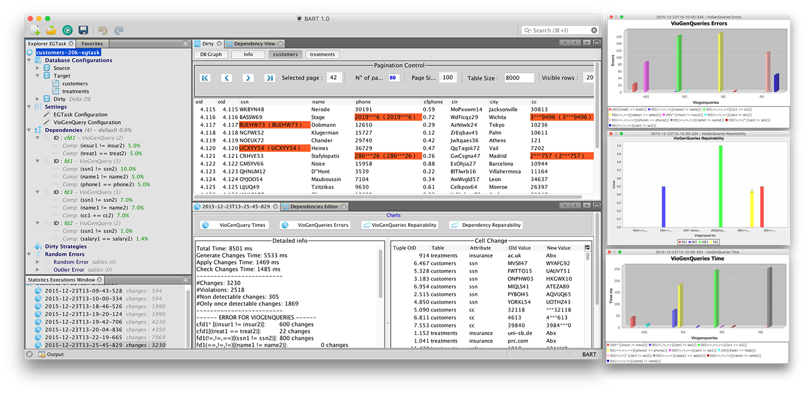

# BART_GUI

BART graphical user interface

BART graphical user interface
  

third party libraries:
<ul>
  <li> ICEpdf -  <a href="http://www.icesoft.org/java/projects/ICEpdf/overview.jsf">http://www.icesoft.org/java/projects/ICEpdf/overview.jsf</a>  </li>
  <li>JFreeChart -  <a href="http://www.jfree.org/jfreechart/">http://www.jfree.org/jfreechart/</a> </li>
  <li>trident  -  <a href="https://github.com/kirill-grouchnikov/trident">https://github.com/kirill-grouchnikov/trident</a>   </li>
</ul>

**Additional material about the project (papers and example datasets) can be found at the following address: [http://db.unibas.it/projects/bart/](http://db.unibas.it/projects/bart/)**

---

### BART GUI Screenshot ###
 
---

